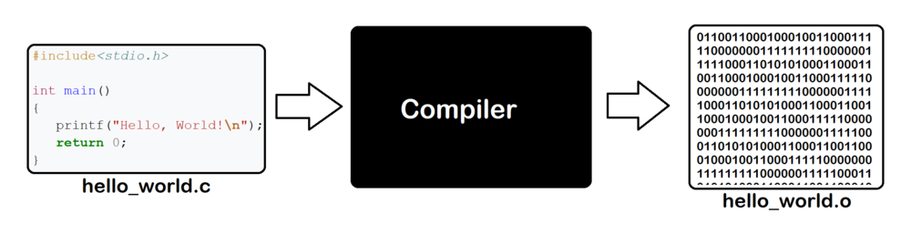

# Basic of Compiler

## What the compiler is



A compiler is a specialized computer program that translates code written in one programming language into another language, typically transforming source code written in a high-level programming language (like C, C++, or Rust) into machine code, assembly language, or another high-level language. This conversion process enables the computer to execute the program.

The primary purpose of a compiler is to turn the source code, which is written by humans and understandable by humans, into a language that machines can understand and execute. 

## Your first compile 

Let's compile simple hello world program

```c++
#include <iostream>

int main(void)
{
    std::cout<<"Hello World!"<<std::endl;
}
```

Compile.

```bash
cd 01_basic_of_compiler
g++ hello.cpp -o hello.exe
```

Commands tear down

- g++ : Compile c++ program with gcc compiler
- main.cpp : input c++ file
- -o main.exe : output file name is main.exe

Run program
```bash
.\hello.exe
Hello World!
```

## Add Include Directory

Compile target c++ file which need header file

```cpp
#include <iostream>
#include "happy.h" // It needs header file!
int main(void)
{
    auto happy = HappyFoo();
    std::cout<<"My happiness is "<<happy.happiness<<std::endl;
}
```

If compile without information of header file location,
```bash
g++ happy.cpp -o happy.exe
```

Compilation fails

```bash
happy.cpp:2:10: fatal error: happy.h: No such file or directory
    2 | #include "happy.h" // It needs header file!
      |          ^~~~~~~~~
compilation terminated.
```

We can let compiler know where the header file is with ```-I``` option.

```bash
g++ happy.cpp -o happy.exe -I ./include
```

Then, happy can be compiled. :)

## Transition to Build Systems

### Why Use a Build System?

While manually compiling code as shown above can be straightforward for small projects, it quickly becomes cumbersome as the complexity grows. Managing multiple source files, dependencies, different libraries, and various build configurations manually can lead to errors and a significant amount of repetitive work. This is where a build system like CMake comes into play.

### Introducing CMake

CMake is a cross-platform build system generator. It allows you to specify the build process in a high-level script, which CMake then uses to generate native build tool configurations (like Makefiles on Unix or project files for Visual Studio on Windows). This automation simplifies the build process significantly.
